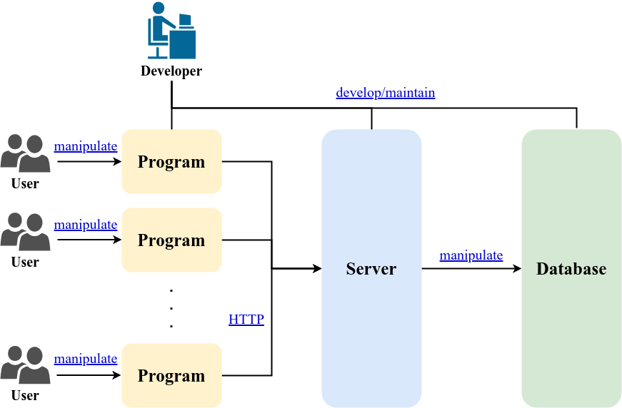

# ShopProject




## Functions

### Enroll Member 註冊會員

**Input**
|Parameter| Type | Illustration |
| :--: | :--: | :-- |
| name_member | string | 會員名稱 |
| email_member | string | 會員的email,視作帳號使用 |
| password_member | string | 會員的密碼 |

**Database**

Insert a new data about member with atttributes
_id,name_member,date_enrolled,email_member,password_member,balance_member

*balance_member*: 會員的餘額,註冊的時候是0元

**Output**
|Parameter| Type | Illustration |
| :--: | :--: | :-- |
| _id | string | 會員的uuid |

```cpp
//註冊新的會員
std::string enroll_member(std::string name_member, std::string email_member, std::string password_member) {
    try
    {
        http::Request request{ "http://140.113.213.57:5125/enroll_member" };
        const std::string body = "{\"name_member\": \""+name_member+"\", \"email_member\": \"" +email_member+"\", \"password_member\": \"" +password_member+"\"}";
        const auto response = request.send("POST", body, {
            {"Content-Type", "application/json"}
            });
        std::cout << "_id= " << std::string{response.body.begin(), response.body.end()} << '\n'; // print the result
        return std::string{ response.body.begin(), response.body.end() };
    }
    catch (const std::exception& e)
    {
        std::cerr << "Request failed, error: " << e.what() << '\n';
    }

    return "ERROR:ENROLL NEW MEMBER ACCOUNT FAILED!";
}
```
### Login Member Account 登入會員

**Input**
|Parameter| Type | Illustration |
| :--: | :--: | :-- |
| email_member | string | 會員的email,視作帳號使用 |
| password_member | string | 會員的密碼 |

**Database**

Find data about member with atttributes and return 
_id,name_member,date_enrolled,email_member,password_member,balance_member

**Output**
|Parameter| Type | Illustration |
| :--: | :--: | :-- |
| _id | string | 會員的uuid |
| name_member | string | 會員名稱 |
| date_enrolled | date | 會員的註冊日期 |
| email_member | string | 會員的email,視作帳號使用 |
| password_member | string | 會員的密碼 |
| balance_member | int | 會員的餘額 |

```cpp
//登入已有的會員帳號
std::string login_member(std::string email_member, std::string password_member) {
    try
    {
        http::Request request{ "http://140.113.213.57:5125/login_member" };
        const std::string body = "{\"email_member\": \"" + email_member + "\", \"password_member\": \"" + password_member + "\"}";
        const auto response = request.send("POST", body, {
            {"Content-Type", "application/json"}
            });
        std::cout << "_id= " << std::string{ response.body.begin(), response.body.end() } << '\n'; // print the result
        return std::string{ response.body.begin(), response.body.end() };
    }
    catch (const std::exception& e)
    {
        std::cerr << "Request failed, error: " << e.what() << '\n';
    }

    return "ERROR:ENROLL NEW MEMBER ACCOUNT FAILED!";
}
```
### Store Balance 會員儲值

**Input**
|Parameter| Type | Illustration |
| :--: | :--: | :-- |
| _id | string | 會員的uuid |
| balance_member | int | 會員儲值的額度，必須大於0且為整數 |

**Database**

Update the balance of specified member with adding balance posted.

**Output**
|Parameter| Type | Illustration |
| :--: | :--: | :-- |
| balance | int | 會員更新後的餘額 |

```cpp
//儲值到現有帳號
int store_balance(std::string _id, int balance_member) {
    
    std::string balance = std::to_string(balance_member);
    try
    {
        http::Request request{ "http://140.113.213.57:5125/store_balance" };
        const std::string body = "{\"_id\": \"" + _id + "\", \"balance_member\": \"" + balance + "\"}";
        const auto response = request.send("POST", body, {
            {"Content-Type", "application/json"}
            });
        std::cout << "balance= " << std::string{ response.body.begin(), response.body.end() } << '\n'; // print the result
        return std::stoi(std::string{ response.body.begin(), response.body.end() });
    }
    catch (const std::exception& e)
    {
        std::cerr << "Request failed, error: " << e.what() << '\n';
    }

    return -1;
}
```
### Upload Commodity 上架商品

**Input**
|Parameter| Type | Illustration |
| :--: | :--: | :-- |
| _id_seller | string | 販售商品的賣家會員的uuid |
| name_commodity | string | 商品名稱，可以重複 |
| price | int | 商品單價，必須大於0且為整數 |
| inventory | int | 商品的初始庫存量 |

**Database**

Insert a new data about commodity with atttributes
_id,name_commodity,_id_seller,price,inventory

**Output**
|Parameter| Type | Illustration |
| :--: | :--: | :-- |
| _id_commodity | string | 商品的uuid |

```cpp
//上傳商品售賣
std::string upload_commodity(std::string _id_seller, std::string name_commodity,int price, int inventory) {
    std::string pricestr= std::to_string(price);
    std::string inventorystr = std::to_string(inventory);
    try
    {
        http::Request request{ "http://140.113.213.57:5125/upload_commodity" };
        const std::string body = "{\"_id_seller\": \"" + _id_seller + "\", \"name_commodity\": \"" + name_commodity + "\", \"price\": \"" + pricestr + "\", \"inventory\": \"" + inventorystr+"\"}";
        const auto response = request.send("POST", body, {
            {"Content-Type", "application/json"}
            });
        std::cout << "_id= " << std::string{ response.body.begin(), response.body.end() } << '\n'; // print the result
        return std::string{ response.body.begin(), response.body.end() };
    }
    catch (const std::exception& e)
    {
        std::cerr << "Request failed, error: " << e.what() << '\n';
    }

    return "ERROR:ENROLL NEW MEMBER ACCOUNT FAILED!";
}
```

### View Commodity 檢視商品

**Database**

Find all the valid commodites and output

**Output**

Array of commodities

|Parameter| Type | Illustration |
| :--: | :--: | :-- |
| _id | string | 商品的uuid |
| name_commodity | string | 商品的名稱 |
| _id_seller | string | 賣家的uuid |
| price | int | 商品的價格 |
| inventory | int | 商品的剩餘庫存 |

```cpp
//查看商品列表
std::string view_commodity() {
    try
    {
        // you can pass http::InternetProtocol::V6 to Request to make an IPv6 request
        http::Request request{ "http://140.113.213.57:5125/view_commodity" };

        // send a get request
        const auto response = request.send("GET");
        std::cout << std::string{ response.body.begin(), response.body.end() } << '\n'; // print the result
        return std::string{ response.body.begin(), response.body.end() };
    }
    catch (const std::exception& e)
    {
        std::cerr << "Request failed, error: " << e.what() << '\n';
    }
    return "ERROR";
}
```

### Buy Commodity 購買商品

**Input**
|Parameter| Type | Illustration |
| :--: | :--: | :-- |
| _id_buyer | string | 買家會員的uuid |
| _id_seller | string | 賣家會員的uuid |
| _id_commdity | string | 購買商品的uuid |
| number | int | 購買數量 |

**Database**

Count the number * price to be total trade money.
- *Buyer* balance minuse total trade money
- *Seller* balance add total trade money
- *Commodity* inventory minuse number,if inventory is zero,delete the commodity
  
**Output**
|Parameter| Type | Illustration |
| :--: | :--: | :-- |
| _id_commodity | string | 商品的uuid |

```cpp
//上傳商品售賣
std::string upload_commodity(std::string _id_seller, std::string name_commodity,int price, int inventory) {
    std::string pricestr= std::to_string(price);
    std::string inventorystr = std::to_string(inventory);
    try
    {
        http::Request request{ "http://140.113.213.57:5125/upload_commodity" };
        const std::string body = "{\"_id_seller\": \"" + _id_seller + "\", \"name_commodity\": \"" + name_commodity + "\", \"price\": \"" + pricestr + "\", \"inventory\": \"" + inventorystr+"\"}";
        const auto response = request.send("POST", body, {
            {"Content-Type", "application/json"}
            });
        std::cout << "_id= " << std::string{ response.body.begin(), response.body.end() } << '\n'; // print the result
        return std::string{ response.body.begin(), response.body.end() };
    }
    catch (const std::exception& e)
    {
        std::cerr << "Request failed, error: " << e.what() << '\n';
    }

    return "ERROR:ENROLL NEW MEMBER ACCOUNT FAILED!";
}
```
## About server

## About client

|Folder| Illustration|
| :--: | :-- |
| HTTPRequestGetTest | Project to test http request about get ,z.B:http://140.113.213.57:5125/view_commodity |
| HTTPRequestPostTest | Project to test http request about post ,z.B:http://140.113.213.57:5125/enroll_member |

## About reference

[HTTPRequest](https://github.com/elnormous/HTTPRequest)

